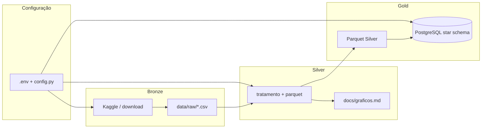

# -*- coding: utf-8 -*-
"""
Ponto de entrada opcional: execute ``python readme.py`` para imprimir o guia no terminal.
O conteúdo completo está em ``GUIA_USUARIO`` (string Markdown).
"""

GUIA_USUARIO = r"""
# Lab01 — Guia para novo usuário

Este repositório contém um pipeline de dados em camadas **Bronze → Silver → Gold** para
tracks do Spotify (download bruto, tratamento, parquet analítico e carga em PostgreSQL em
star schema).

## Diagrama do fluxo (visão geral)

```
                    +------------------+
                    |   .env / config  |
                    +--------+---------+
                             |
   +-------------------------+-------------------------+
   |                         |                         |
   v                         v                         v
+--------+             +----------+              +-----------+
| BRONZE |   CSV em    |  SILVER  |   Parquet    |   GOLD    |
|        | ----------> |          | -----------> |           |
| Kaggle |   data/raw  | tratamento|  data/silver | PostgreSQL|
+--------+             +----------+              | star schema|
                                                 +-----------+
        download              limpeza                 dim + fato
        features              + gráficos             + ponte
                              docs/graficos.md
```

### Mesmo fluxo em Mermaid (cole em um editor que renderize Mermaid)



---

## 1. Clonar o repositório

```bash
git clone <url-do-repositorio>
cd Lab01_PART1_18107134
```

## 2. Ambiente Python

Recomenda-se um ambiente virtual:

```bash
python -m venv venv
# Windows:
venv\Scripts\activate
# Linux/macOS:
source venv/bin/activate

pip install -r requirements.txt
```

## 3. Configurar o `.env`

Na **raiz do projeto**, copie o exemplo e edite:

```bash
# Windows
copy .env.exemple .env
# Linux / macOS
# cp .env.exemple .env
```

Preencha no mínimo:

| Chave | Uso |
|-------|-----|
| `DATASET` | Identificador do dataset (ex.: Kaggle) |
| `RAW_DIR` | Pasta dos CSV brutos (ex.: `data/raw`) |
| `SILVER_DIR` | Saída do parquet Silver (ex.: `data/silver`) |
| `SILVER_PARQUET_NAME` | Nome do arquivo parquet (padrão: `tracks_features_silver.parquet`) |
| `DOCS_DIR` | Relatórios Markdown (ex.: `docs`) |

**Kaggle** (Bronze): `KAGGLE_USERNAME` e `KAGGLE_KEY` no `.env` ou variáveis de ambiente.

**PostgreSQL** (Gold): defina `PG_HOST`, `PG_PORT`, `PG_USER`, `PG_PASSWORD`, `PG_DATABASE`,
`PG_SCHEMA`. Para rodar **apenas Bronze/Silver**, você pode **omitir** todas as chaves `PG_*`.

Opcional: `SILVER_SCATTER_SAMPLE_SIZE` (amostra para gráficos scatter).

## 4. Executar os pipelines

Execute a partir da **raiz do repositório** (para imports `scripts.*` funcionarem).

### Bronze — obter dados brutos

```bash
python -m scripts.bronze.bronze
```

Gera CSV em `RAW_DIR` (conforme script Bronze do projeto).

### Silver — tratamento e parquet

```bash
python -m scripts.silver.silver
```

Lê o CSV em `RAW_DIR`, aplica tratamento, grava parquet em `SILVER_DIR` e atualiza
`DOCS_DIR/graficos.md` com PNGs em `DOCS_DIR/graficos/`.

### Gold — carga analítica (PostgreSQL)

Requer Postgres acessível e chaves `PG_*` no `.env`.

```bash
python -m scripts.gold.gold
```

Lê o parquet Silver e carrega o **star schema** (`dim_album`, `dim_artist`, `dim_date`,
`fact_track_features`, `bridge_track_artist`) no schema configurado em `PG_SCHEMA`.

## 5. Ordem sugerida para um primeiro uso

1. Criar venv e `pip install -r requirements.txt`
2. Criar `.env` a partir de `.env.exemple`
3. Preencher credenciais Kaggle (se usar Bronze)
4. `python -m scripts.bronze.bronze`
5. `python -m scripts.silver.silver`
6. (Opcional) Subir PostgreSQL e preencher `PG_*`, depois `python -m scripts.gold.gold`

## 6. Estrutura útil do projeto

- `scripts/utils/config.py` — leitura do `.env` e `Settings`
- `scripts/bronze/` — ingestão bruta
- `scripts/silver/` — tratamento, parquet, gráficos
- `scripts/gold/` — conexão DB, pipeline e `star_schema.py`

---


