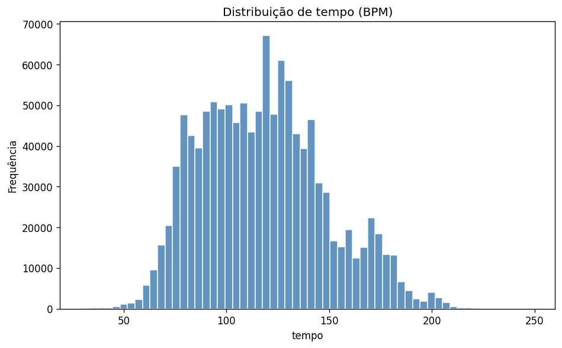
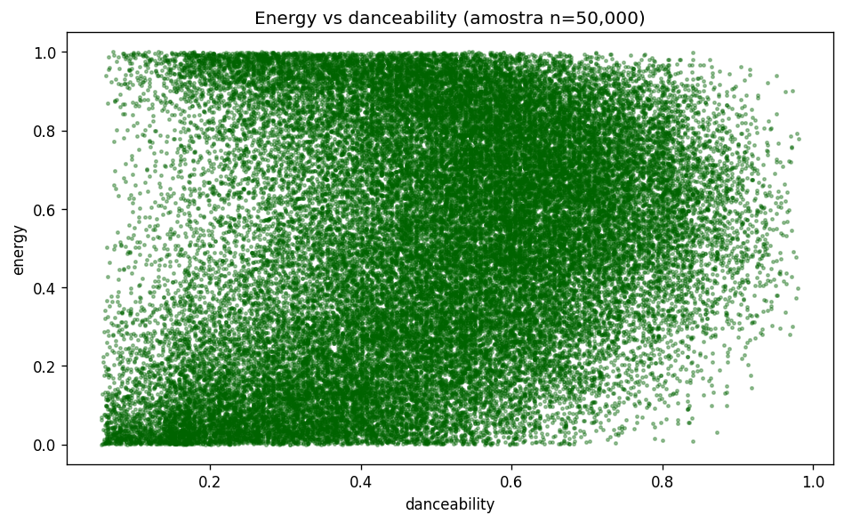
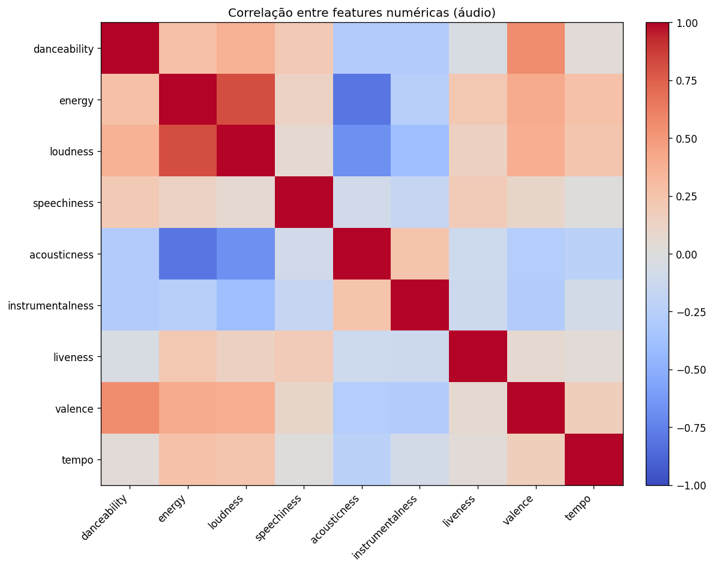
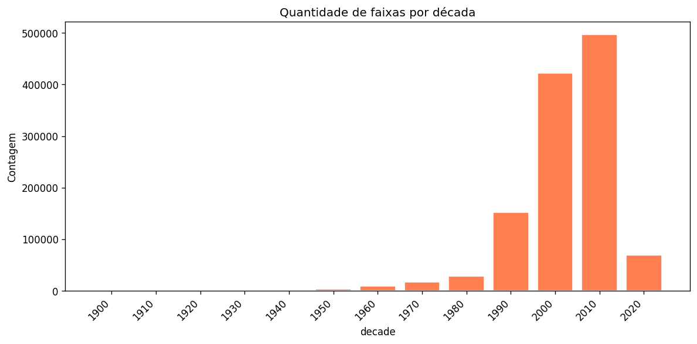
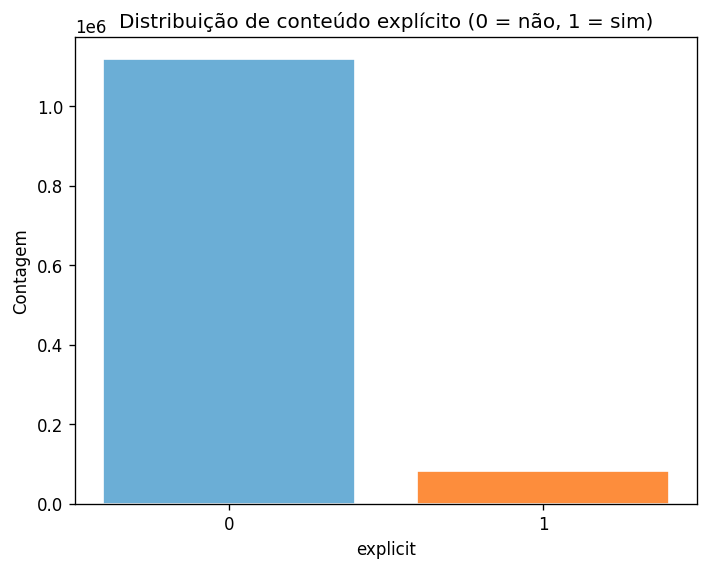

# Gráficos — Silver (rodolfofigueroa/spotify-12m-songs)

> Gerado em 2026-03-24 15:03:21

## 1. Histograma — tempo (BPM)

## 2. Dispersão — energy vs danceability (amostra)

## 3. Mapa de calor — correlação entre features

## 4. Barras — faixas por década

## 5. Barras — conteúdo explícito

